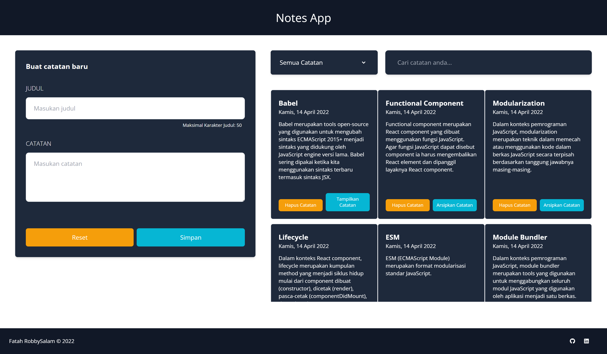

# Getting Started with Create React App

This project was bootstrapped with [Create React App](https://github.com/facebook/create-react-app).
This project was finished the submission on Dicoding Learning Path.

## Available Scripts

In the project directory, you can run:

### `npm start`

### `npm test`

### `npm run build`

### `npm run eject`

### Project Result

